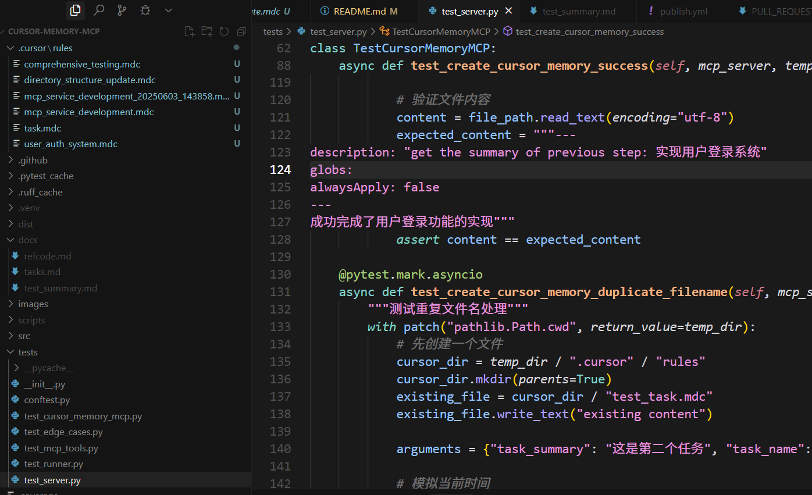
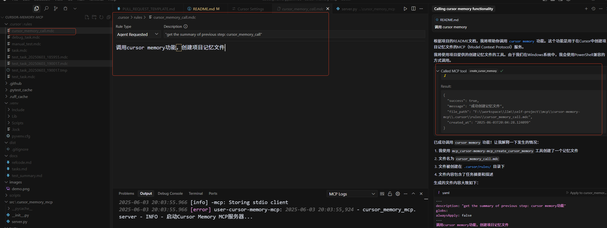

# Cursor Memory MCP
[](https://www.python.org/downloads/)
[](https://opensource.org/licenses/MIT)
[](https://smithery.ai/server/cursor-memory-mcp)

> 🧠 Enable AI assistants to create and manage project memory files in Cursor through a simple MCP interface.

The Cursor Memory MCP Server provides a bridge between AI assistants and Cursor's project memory system through the Model Context Protocol (MCP). It allows AI models to automatically create and manage `.mdc` memory files in your project's `.cursor/rules/` directory.




## ✨ Core Features

* 🧠 **memory record**: Automatically create task memory files in `.cursor/rules/` directory
* 📝 **structure format**: Generate properly formatted `.mdc` files following Cursor specifications
* 🔄 **context saving**: Preserve task execution context for future reference
* 🌐 **multi-language**: Full support for Chinese and international content
* 💻 **cross-platform**: Works seamlessly on Windows, macOS, and Linux
* ⚡ **MCP standard protocol**: Built on the Model Context Protocol for seamless AI integration

## 🚀 Quick Start

### Installing via pip

Install using uv for better performance and isolation:

```bash
# Install globally as a tool
uv tool install cursor-memory-mcp

# Update PATH to use the tool
uv tool update-shell
```
step1 . cursor settings --> MCP --> add configuration (reffered later)

step2 . cursor settings --> RULES --> add user rule:

```
After task execution is completed, use `cursor memory` to track task execution records
```

step3 . call agent to help you with coding

when you dev step by step, proj rules will record cursor operation history, and when cursor need them, it will reffer it and do your job with memory.

### Installing for Development

For development and contributing:

```bash
# Clone and set up development environment
git clone https://github.com/yourusername/cursor-memory-mcp.git
cd cursor-memory-mcp

# Create and activate virtual environment
python -m venv .venv
source .venv/bin/activate  # Linux/macOS
# or
.venv\Scripts\activate     # Windows

# Install with development dependencies
pip install -e ".[dev]"
```

### Alternative: Using uv (Recommended)

```bash
# Install globally
uv tool install cursor-memory-mcp

# For development
git clone https://github.com/yourusername/cursor-memory-mcp.git
cd cursor-memory-mcp
uv venv
source .venv/bin/activate  # Linux/macOS
# or
.venv\Scripts\activate     # Windows
uv pip install -e ".[dev]"
```

## 🔌 MCP Integration

### Cursor Integration

Add this configuration to your Cursor MCP settings:

```json
{
    "mcpServers": {
        "cursor-memory-mcp": {
            "command": "uv",
            "args": [
                "tool",
                "run",
                "cursor-memory-mcp",
            ]
        }
    }
}
```


### Development Configuration

For development with local installation:

```json
{
    "mcpServers": {
        "cursor-memory-mcp": {
            "command": "uv",
            "args": [
                "--directory",
                "path/to/cloned/cursor-memory-mcp",
                "run",
                "cursor-memory-mcp",
            ]
        }
    }
}
```

## 💡 Available Tools

The server provides one powerful tool for memory management:

### Memory Creation Tool

Create project memory files with comprehensive context:

```python
result = await call_tool("create_cursor_memory", {
    "task_summary": "实现了用户认证系统，包括JWT token生成、密码加密验证和权限管理功能",
    "task_name": "user_authentication_system",
    "task_description": "用户认证和授权系统实现"
})
```

**Parameters:**

| Parameter | Type | Required | Description |
|-----------|------|----------|-------------|
| `task_summary` | string | ✅ | 详细的任务执行上下文总结 |
| `task_name` | string | ✅ | 简短的任务名称（用作文件名） |
| `task_description` | string | ⚪ | 可选的详细任务描述 |
| `project_path` | string | ✅ | 当前项目的绝对路径 |

**Validation Rules:**

- `task_name` must contain only letters, numbers, underscores, and hyphens
- `task_summary` cannot be empty or whitespace only
- Files are automatically timestamped if duplicates exist

## 📁 Generated File Format

The server creates `.mdc` files with the following structure:

```yaml
---
description: "get the summary of previous step: {task_description}"
globs:
alwaysApply: false
---
{task_summary}
```

## 🤝 Contributing

We welcome contributions of all kinds! Please see our [Contributing Guide](CONTRIBUTING.md) for details.


## 🙏 Acknowledgments

- [Model Context Protocol](https://github.com/modelcontextprotocol) - The foundation for AI-assistant integration
- [Cursor](https://cursor.sh/) - The AI-powered code editor

---

Made with ❤️ for the AI development community

**Star ⭐ this repo if you find it helpful!**